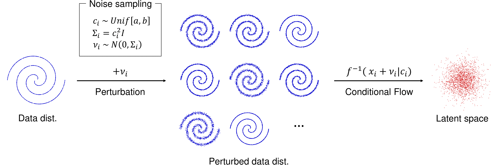
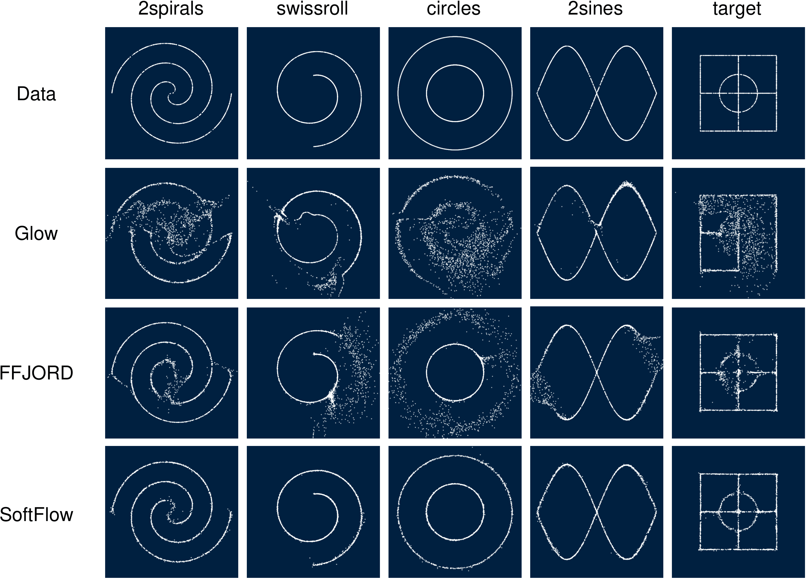
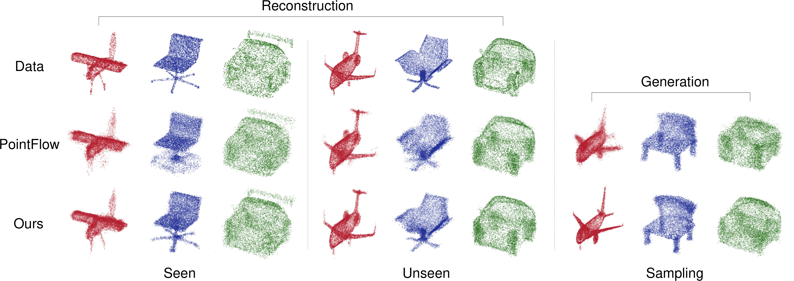

# SoftFlow: Probabilistic Framework for Normalizing Flow on Manifolds

This repository provides the implementation of SoftFlow on toy dataset and point clouds. Move to each folder, follow the instructions and enjoy the results!

## Overview

    

 Flow-based generative models are composed of invertible transformations between two random variables of the same dimension. Therefore, flow-based models cannot be adequately trained if the dimension of the data distribution does not match that of the underlying target distribution. In this paper, we propose SoftFlow, a probabilistic framework for training normalizing flows on manifolds. To sidestep the dimension mismatch problem, SoftFlow estimates a conditional distribution of the perturbed input data instead of learning the data distribution directly. We experimentally show that SoftFlow can capture the innate structure of the manifold data and generate high-quality samples unlike the conventional flow-based models. Furthermore, we apply the proposed framework to 3D point clouds to alleviate the difficulty of forming thin structures for flow-based models. The proposed model for 3D point clouds, namely SoftPointFlow, can estimate the distribution of various shapes more accurately and achieves state-of-the-art performance in point cloud generation. 

## Results
- Toy datasets

    

- Point Clouds

    

## References
- FFJORD: https://github.com/rtqichen/ffjord
- PointFlow: https://github.com/stevenygd/PointFlow
- WaveGlow: https://github.com/NVIDIA/waveglow