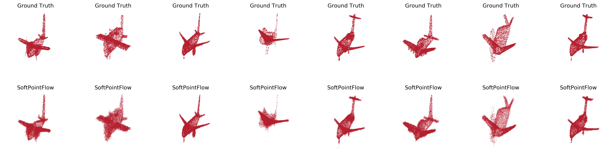
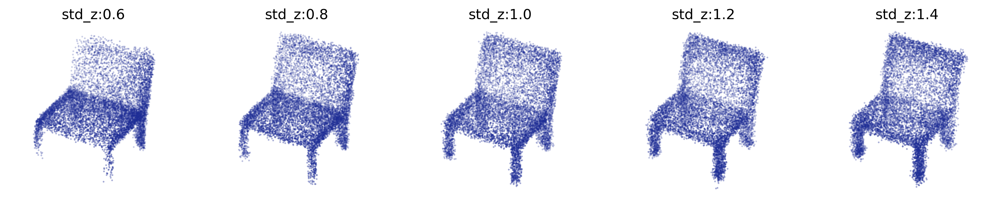

# SoftFlow: Probabilistic Framework for Normalizing Flow on Manifolds

## Requirements
- python 3.6.10
- pytorch 1.0.1
- gcc 7.5
- matplotlib
- tensorboardX
- imageio
- scipy
- sklearn

## Dataset
ShapeNetCore (Ver.2): Click [here](https://github.com/stevenygd/PointFlow) and follow the instructions. 

## Training
```train
CUDA_VISIBLE_DEVICES=0,1,2,3 bash scripts/train.sh
```
> cates: airplane, chair, car

## Generation

To generate samples from the model, run:

```generate1
CUDA_VISIBLE_DEVICES=0 bash scripts/generate1.sh
```

or you can sample from the pretrained model:
```generate1_pretrained
CUDA_VISIBLE_DEVICES=0 bash scripts/generate1_pretrained.sh
```

To generate samples with the different latent variable distributions, run:

```generate2
CUDA_VISIBLE_DEVICES=0 bash scripts/generate2.sh
```
or you can sample from the pretrained model:
```generate2_pretrained
CUDA_VISIBLE_DEVICES=0 bash scripts/generate2_pretrained.sh
```

## Evaluation

Requirements (We tested the code with pytorch 1.0.1 and gcc 7.5. See `install.sh` in [here](https://github.com/stevenygd/PointFlow).):
```requirements
cd metrics/pytorch_structural_losses/
make clean
make
```

To evaluate the model, run:

```evaluate
CUDA_VISIBLE_DEVICES=0 bash scripts/evaluate.sh
```

or you can evaluate the pretrained model:

```evaluate_pretrained
CUDA_VISIBLE_DEVICES=0 bash scripts/evaluate_pretrained.sh
```

## Pre-trained models
- Click this [link](https://drive.google.com/open?id=1w-hrHth_w0GMyTFEjqywvcjGKJDXgR5e) to download the pre-trained models.
```
unzip pretrained_pc.zip
```

## Results
1. Samples from SoftPointFlow (`generate1.py`)
- Airplane
<p align="center">
    
</p>

- Chair
<p align="center">
    
</p>

- Car
<p align="center">
    
</p>

2. Samples with the different latent variable distributions (`generate2.py`)

- Chair
<p align="center">
    
</p>

## References
- PointFlow: https://github.com/stevenygd/PointFlow
- WaveGlow: https://github.com/NVIDIA/waveglow