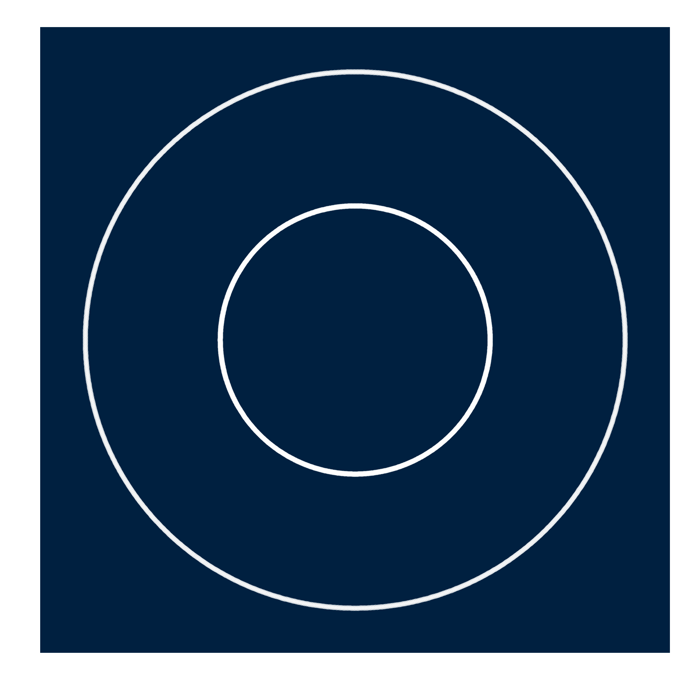

# SoftFlow: Probabilistic Framework for Normalizing Flow on Manifolds

## Requirements
- python 3.6.10
- pytorch 1.0.1
- matplotlib
- sklearn
- torchdiffeq

## Training
```train
python train.py --data 2spirals_1d --dims 64-64-64 --std_min 0.0 --std_max 0.1 --std_weight 2
```
> Datasets: 2spirals_1d, swissroll_1d, circles_1d, 2sines_1d, circles_1d

## Generation

To generate samples from the model, run:

```generate1
python generate1.py --data 2spirals_1d --load_path results/2spirals_1d/SoftFlow/checkpt.pth
```

or you can use the pretrained model:
```generate1_pretrained
python generate1.py --data 2spirals_1d --load_path pretrained/2spirals_1d/checkpt.pth
```

To generate samples with the different noise distributions, run:

```generate2
python generate2.py --data 2spirals_1d --load_path results/2spirals_1d/SoftFlow/checkpt.pth
```

or you can use the pretrained model:
```generate2_pretrained
python generate2.py --data 2spirals_1d --load_path pretrained/2spirals_1d/checkpt.pth
```

## Pre-trained models
- Click this [link](https://drive.google.com/open?id=1hzVzatm-JVUrPpYUAg1CHyHUqrsALJVf) to download the pre-trained models.
```
unzip pretrained_toy.zip
```

## Results
1. Samples from SoftFlow (`generate1.py`)

|               | 2spirals | swissroll | circles | 2sines | target |
|:-------------:|:--------:|:---------:|:-------:|:------:|:------:|
|      Data     ||||||
| SoftFlow ||||||

2. Samples with the different noise distribution (`generate2.py`)

| Csp | 0.0 | 0.02 | 0.04 | 0.06 | 0.08 | 0.1 |
|:---:|:---:|:----:|:----:|:----:|:----:|:---:|
||||||||

## References
- FFJORD: https://github.com/rtqichen/ffjord